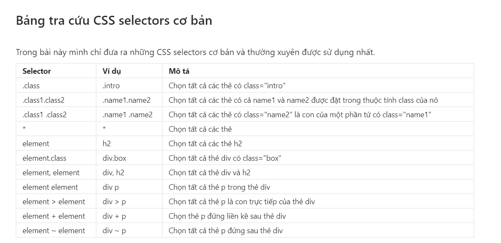
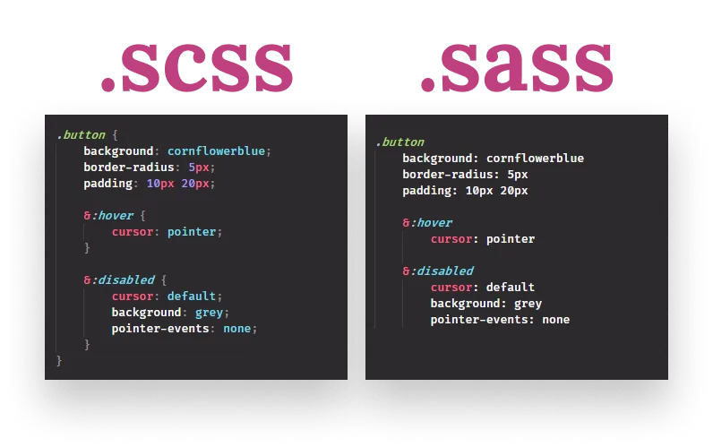
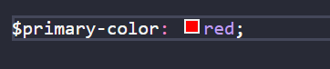
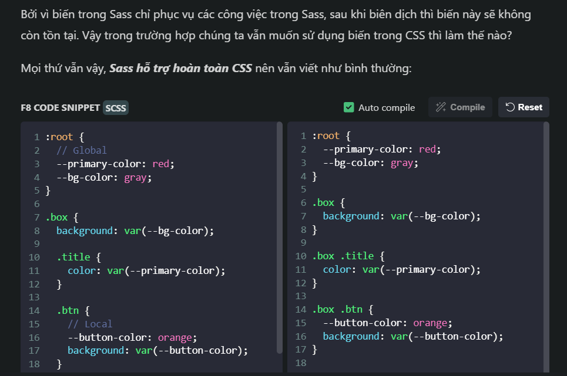
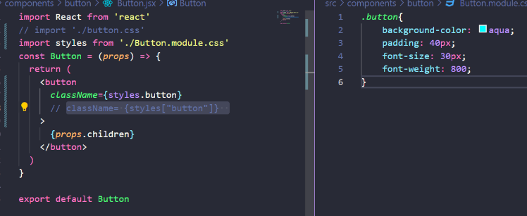
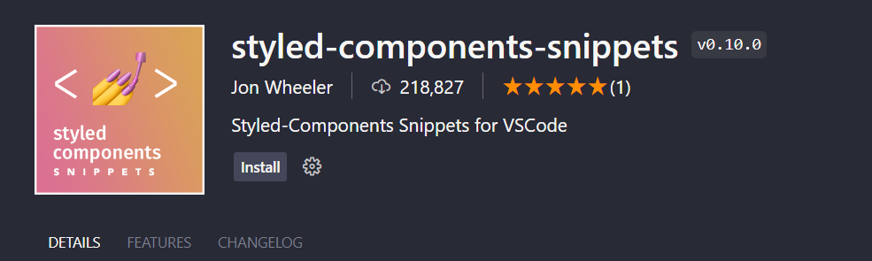
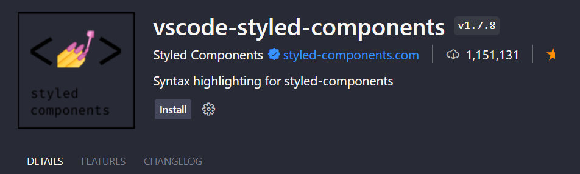
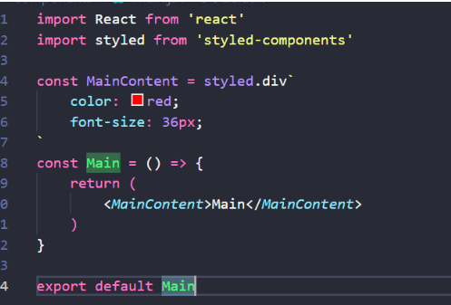
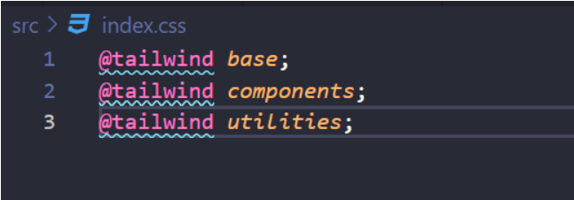
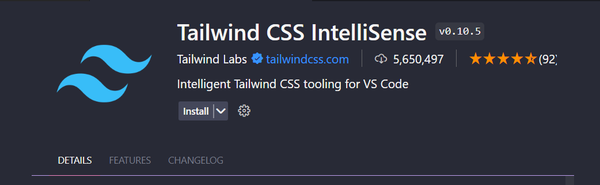

## Styling

### Nhắc lại:


### 1.SCSS
- Tiền thân của SCSS là SASS, do SASS được viết theo cú pháp Ruby, nên tới phiên bản 3.0, SCSS ra đời với cú pháp thân thiện hơn, gần giống với cú pháp CSS
- SASS(Ngôn ngữ tiền xử lý sass): là trình biên dịch SCSS ra css. Bắt buộc phải cài SASS mới dùng được SCSS
- SCSS (Sassy CSS) là một cú pháp mở rộng của CSS3 được SASS hỗ trợ. Điểm khác biệt chính giữa SCSS và CSS là SCSS sử dụng cú pháp tương tự CSS truyền thống, có nghĩa là bạn có thể bắt đầu sử dụng SCSS mà không cần học lại cách viết CSS. 
- Nó giúp bạn viết CSS theo cách của một ngôn ngữ lập trình, có cấu trúc rõ ràng, rành mạch, dễ phát triển và bảo trì code hơn
- Cách cài đặt:  https://www.npmjs.com/package/sass
```sh
    #1. Với npm: 
        npm i sass

    #2. Với yarn
        yarn add sass
```
**Cú pháp linh hoạt hơn**
Ví dụ:


--> Dấu **&** được gọi là Parent selector

**SCSS variable**
- Cú pháp 
```sh
    $name: value;
    
    - Trong đó:
        + $name: tên biến, đặt bất kì không khoảng trắng, chấp nhận hai ký tự đặc biệt là - _
        + value: là giá trị của css hoặc biểu thức
        + Cần thận cú pháp sử dụng dấu : không phải dấu = 
```

- Biến trong Sass có 2 phạm vi:
    + Global: Có thể truy cập trong toàn bộ file Sass kể từ khi khai báo.
    + Local: Chỉ truy cập được trong phạm vi cặp ngoặc { } tại nơi khai báo biến.


SCSS Extend: Với các thuộc tính có cùng kiểu định dạng thì ta có thể kế thừa các thuộc tính đó:
- Cú pháp:
    ```sh
    @extend + tên class/id/tag...
    ```
- VD:
    ```sh
        .btn{
            padding: 8px;
            margin: 0 16px;
            background: #000;
            color: #fff;
        }
        .btn-primary{
            @extend .btn;
            background: blue;
        }
        .btn-secondary{
            @extend .btn;
            background: green;
        }
    ```


**SCSS Mixin: Tương tự như các function**
```sh
  @mixin ten_mixin() {
      @content
  }
```
- VD:
```sh
  @mixin move($direction: top-left) {
    position: absolute;

    @if $direction ==top-left {
        top: 0;
        left: 0;
    }

    @if $direction ==top-right {
        top: 0;
        right: 0;
    }

    @if $direction ==bottom-left {
        bottom: 0;
        left: 0;
    }

    @if $direction ==bottom-right {
        bottom: 0;
        right: 0;
    }

    @if $direction ==center {
        top: 50%;
        left: 50%;
        translate: -50% -50%;
    }
}
```

**SCSS for**
```sh
@for $i from 1 to 10{
    @debug $i;
}
--> Với trường hợp này thì debug chỉ in ra các giá trị từ 1 đến 9

- Muốn debug in ra các giá trị từ 1 đến 10 thì thay chữ to -> through 
```

### 2. CSS Module: tránh xung đột giữa các css trong React


### 3. Style components
- Cài đặt: 
    ```sh
      Npm: npm i styled-components
      yarn: yarn add styled-components
    ```
- Extension:
    + styled-components-snippets
    

    + vscode-styled-components
    

- Cú pháp: <Tên thành phần> = styled.<element>`<code css/scss>`
  

### 4. Tailwind CSS https://tailwindcss.com/docs/installation
- Cài đặt
    ```sh
      npm: npm install -D tailwindcss
      yarn: yarn add -D tailwindcss
  		
      Sau đó: npx tailwindcss init
    ```
- Add đoạn mã sau vào tailwind.config.js 
    ```sh
    /** @type {import('tailwindcss').Config} */
        module.exports = {
          content: ["./src/**/*.{html,js,jsx}"],
          theme: {
            extend: {},
          },
          plugins: [],
        }
    ```
- Add đoạn mã sau vào tệp css chính là index.css

- Cài extension: Tailwind CSS IntelliSense


