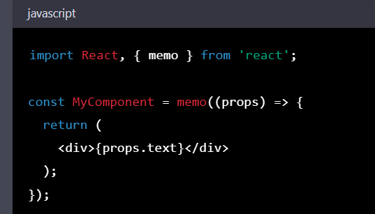

# useRef, useMemo, useCallback

### 1. useRef

- [x] Là một hook trong React được sử dụng để tạo một tham chiếu đến một phần tử DOM hoặc một giá trị khác trong component của bạn. Nó cho phép bạn truy cập và thay đổi giá trị của một thành phần mà không phải render lại component.
- [x] Phân biệt useState và useRef
  - useState: được sử dụng để lưu trữ giá trị của state trong component, khi giá trị state thay đổi thì component sẽ re-render.
  - useRef: được sử dụng để tạo ra một tham chiếu đến một phần tử DOM hoặc một giá trị khác trong component, để thao tác với các phần tử trực tiếp bên trong component.

### 2. useMemo

- [x] Trong React, useMemo là một hook được sử dụng để tối ưu hóa performance của ứng dụng bằng cách lưu trữ kết quả của một hàm được truyền vào và sử dụng lại giá trị đó cho các render khác mà không cần tính toán lại.
- [x] Cách hoạt động của useMemo là bằng cách nhận vào hai tham số: một là một hàm mà kết quả của nó sẽ được lưu trữ, và hai là một mảng dependencies - những giá trị mà nếu có sự thay đổi sẽ gây ra việc tính toán lại giá trị của hàm đó.
- [x] Khi useMemo được sử dụng, React sẽ gọi hàm được truyền vào và lưu trữ kết quả trả về của nó. Nếu dependencies không thay đổi giữa các render, useMemo sẽ trả về giá trị được lưu trữ trước đó, giúp tiết kiệm thời gian tính toán và cải thiện hiệu suất ứng dụng.
      

**- React.memo**

- [x] React.memo là một HOC (Higher Order Component) được sử dụng để tối ưu hiệu suất trong React bằng cách lưu trữ phiên bản memoized (bộ nhớ cache) của một component và trả về nó để sử dụng lại trong các render khác mà không cần render lại component đó.
- [x] Khi một component được bao bọc bởi React.memo, React sẽ so sánh các props được truyền vào component đó với phiên bản props trước đó. Nếu các props không thay đổi, React.memo sẽ trả về phiên bản memoized của component đó đã được lưu trữ trước đó, giúp tiết kiệm thời gian render lại component và cải thiện hiệu suất ứng dụng.
      
- [x] Ở đây, nếu props của MyComponent không thay đổi giữa các render, React.memo sẽ trả về phiên bản memoized của MyComponent đã được lưu trữ trước đó mà không cần render lại component. Nếu props thay đổi, React.memo sẽ render lại component.

### 3. useCallback

- [x] Tránh tạo ra các hàm mới một cách không cần thiết
- [x] Trong React, useCallback là một hook được sử dụng để tối ưu hiệu suất bằng cách lưu trữ phiên bản memoized (bộ nhớ cache) của một hàm và trả về nó để sử dụng lại trong các render khác mà không cần tạo lại hàm đó.
- [x] Cách hoạt động của useCallback là bằng cách nhận vào hai tham số: một là một hàm mà phiên bản memoized của nó sẽ được lưu trữ, và hai là một mảng dependencies - những giá trị nào khi thay đổi sẽ làm cho useCallback tạo lại phiên bản mới của hàm.
- [x] Khi useCallback được sử dụng, React sẽ tạo ra một phiên bản memoized của hàm được truyền vào và trả về nó. Nếu dependencies không thay đổi giữa các render, useCallback sẽ trả về phiên bản memoized đã được lưu trữ trước đó, giúp tiết kiệm thời gian tạo lại hàm và cải thiện hiệu suất ứng dụng.
      
