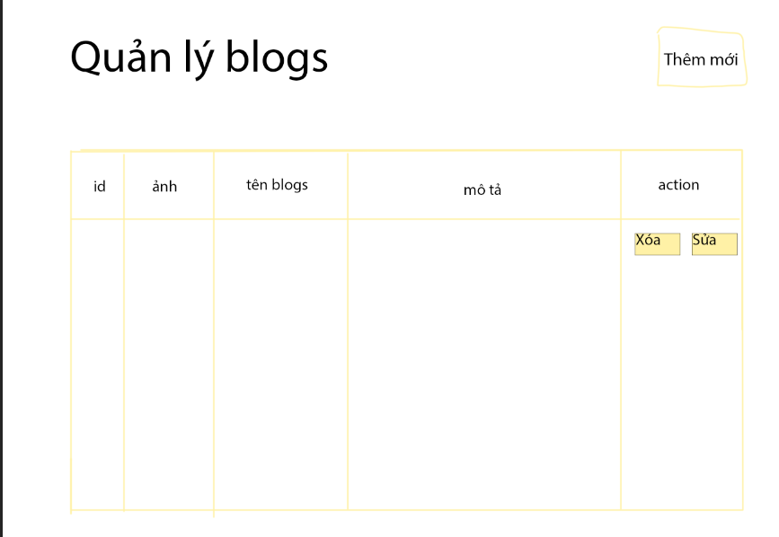

# Bài kiểm tra số 1

##### Đề 1: crud blogs

##### Đề 2: crud products

##### Đề 3: crud users

##### Đề 4: crud sự kiện

##### Đề 5: crud ghi chú

##### Đề 6: crud công việc

##### Đề 7: crud môn học

##### Đề 8: crud danh sách các mặt hàng cần mua

**--> Thời gian: 90p**
Yêu cầu:

- [x] Giao diện sẽ theo form sau (nhớ scss)
      
- [x] crud là tạo/hiển thị/sửa/xóa
