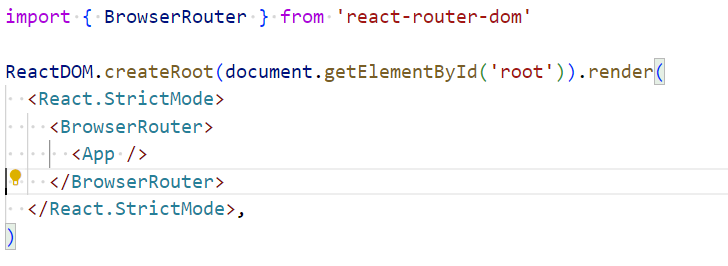
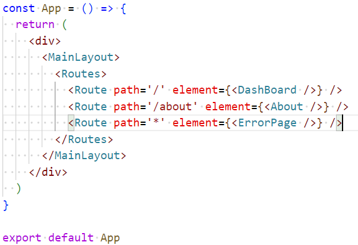
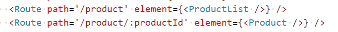
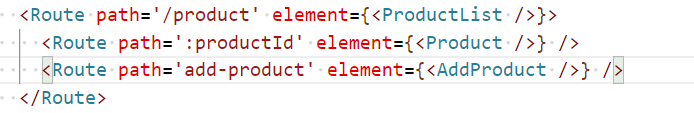
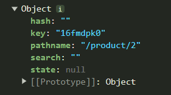
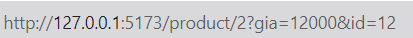
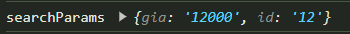

# React Router

React Router là một thư viện phần mềm được sử dụng trong ứng dụng React để quản lý định tuyến (routing). Nó cung cấp các công cụ cho việc chuyển đổi giữa các trang và các thành phần khác nhau của ứng dụng mà không cần tải lại trang. 

Với React Router, ta có thể tạo ra các đường dẫn URL, xác định các tham số và truyền chúng vào các thành phần React, cho phép người dùng điều hướng qua lại giữa các trang của ứng dụng một cách linh hoạt. 

React Router còn có nhiều tính năng khác như cho phép ta tạo các bộ lọc, xác thực yêu cầu và điều hướng bảo vệ trang. Sử dụng React Router giúp cho việc xây dựng ứng dụng React trở nên dễ dàng và tiện lợi hơn.

# React router dom
https://reactrouter.com/en/main/start/tutorial

React-router-dom là một phiên bản của React Router dành riêng cho ứng dụng web. Nó cung cấp một số thành phần để giúp quản lý định tuyến trên ứng dụng web.

Cài đặt

```ruby
npm: npm i react-router-dom
yarn: yarn add react-router-dom
```

### Cách sử dụng: 
#### Tại file main.jsx



Lúc này ta đã có thể sử dụng react-router-dom trong dự án của mình

### Phân biệt 1 số loại Router Component
https://github.com/duthanhduoc/Hoc-Nhanh-React-Router/blob/main/README.md

## Các chức năng 
### 1. Định tuyến cho trang web

Thường ta sẽ định tuyến cho các thành phần của trang web tại file App.jsx 

#### Cách 1 (dài):



Trong đó to thực hiện định tuyến cho thành phần nào đó, element là các thành phần được định tuyến, thường là các component

Trường hợp khi các bạn muốn một đường dẫn chi tiết tới thành phần nào đó ta sẽ sử dụng slug tại đường dẫn 

### 2. Điều hướng bằng Link, NavLink trong react-router-dom
```ruby
const MainLayout = ({ children }) => {
  return (
    <div style={{ display: 'flex', gap: '20px' }}>
      <div style={{ display: 'flex', flexDirection: 'column' }}>
        <NavLink
          to="/"
          // render props
          className={({ isActive }) => isActive ? 'active' : ''}
        >
          <span>DashBoard</span>
        </NavLink>
        <NavLink
          to="/about"
          className={({ isActive }) => isActive ? 'active' : ''}
        >
          <span>About</span>
        </NavLink>
      </div>
      {children}
    </div>
  )
}
export default MainLayout
```

#### Active link với NavLink trong react-router-dom

Gần giống như thẻ a thành phần Link có nhiệm vụ liên kết và đưa trang web tới đường dẫn mong muốn, nhưng khi dùng thẻ a chúng ta sẽ bị re-render lại trang web
Vì thế Link trong react-router-dom sẽ giúp điều hướng và không làm re-render lại trang web

Trong react-router-dom, Link và NavLink là hai thành phần (component) được sử dụng để tạo liên kết giữa các trang web trong ứng dụng React. 

Có một số khác biệt giữa Link và NavLink như sau: Link là thành phần cơ bản để tạo liên kết giữa các trang, nó sẽ tạo ra một thẻ a khi render. Đây là lựa chọn phổ biến để tạo liên kết trong React. 

NavLink cũng tạo ra một thẻ a, nhưng có tính năng đặc biệt hơn Link. Khi liên kết được kích hoạt, NavLink sẽ tự động thêm một lớp CSS hoặc một thuộc tính khác vào thẻ a để đánh dấu rằng liên kết này đang được hoạt động. 

Vì vậy, Link và NavLink đều có thể được sử dụng để tạo liên kết giữa các trang trong react-router-dom, tuy nhiên NavLink có thêm tính năng đánh dấu liên kết đang được hoạt động.


### 3. Dynamic Route với id

Ví dụ:
Thêm 2 route vào App.jsx



ProductList.jsx

```ruby
import { Link } from 'react-router-dom'

const ProductList = () => {
  return (
    <div style={{display: 'flex', flexDirection: 'column'}}>
      <Link to="/product/1">Product 1</Link>
      <Link to="/product/2">Product 2</Link>
      <Link to="/product/3">Product 3</Link>
    </div>
  )
}

export default ProductList
```
Product.jsx
```ruby
import { useNavigate, useParams } from "react-router-dom"

const Product = () => {
  const { productId } = useParams();
  const navigate = useNavigate();

  return (
    <div>
      <div>Nội dung của product {productId}</div>
      <div onClick={() => navigate('/about')}>About</div>
    </div>
  )
}

export default Product
```

### 4. Outlet 
Outlet là một thành phần của react-router-dom, được sử dụng để hiển thị nội dung của các route con trong ứng dụng React. Để sử dụng Outlet, bạn cần tạo ra một số route con trong Routes component, và mỗi route con sẽ có một đường dẫn (path) và một component để hiển thị.

Sau đó, chúng ta cần sử dụng Outlet để hiển thị nội dung của các route con này. Bạn có thể đặt Outlet bất cứ đâu trong component cha, và nội dung của các route con sẽ được hiển thị ở đó.

Trong App.jsx



ProductList.jsx
```ruby
import { Link, Outlet } from 'react-router-dom'

const ProductList = () => {
  return (
    <div>
      <div style={{ display: 'flex', flexDirection: 'column' }}>
        <Link to="/product/1">Product 1</Link>
        <Link to="/product/2">Product 2</Link>
        <Link to="/product/3">Product 3</Link>
      </div>

      <div>Nội dung của các outlet</div>
      <Outlet />
    </div>
  )
}

export default ProductList
```


### Cách 2 khai báo Routes ngắn gọn hơn
Trong App.jsx
```ruby
const elements = useRoutes([
    {
      path: '/',
      element: <Dashboard />
    },
    {
      path: '/about',
      element: <About />
    },
    {
      path: '/staff/*',
      element: <ProductList />
    },
    {
      path: '*',
      element: <ErrorPage />
    }
])
```
# Các hooks thường dùng

### useParams

useParams() là một hook của react-router-dom, được sử dụng trong các component để lấy giá trị của tham số đường dẫn (URL parameters) truyền vào. 

Khi bạn định nghĩa một route với một tham số đường dẫn, ví dụ như /users/:userId, thì tham số này sẽ được lưu trữ trong đối tượng params của đường dẫn. 

Ví dụ: nếu đường dẫn là /users/123, thì params sẽ có giá trị { userId: "123" }. Để lấy giá trị của tham số đường dẫn này trong một component, bạn có thể sử dụng useParams()

### useNavigate

useNavigate là một hook của react-router-dom, được sử dụng để điều hướng (navigate) đến một trang web khác trong ứng dụng React.

### useLocation

là một hook của react-router-dom,, thường dùng để xem đang ở route nào, ...

```ruby
  const location = useLocation();
  console.log(location);
```



### useSearchParams
```ruby
const [searchParams] = useSearchParams();
  useEffect(() => {
    console.log('searchParams', Object.fromEntries([...searchParams]))
  }, [searchParams])
```




### useOutletContext

share state giữa các component

```ruby
function Parent() {
  const [count, setCount] = React.useState(0);
  return <Outlet context={[count, setCount]} />;
}
```

```
import { useOutletContext } from "react-router-dom";

function Child() {
  const [count, setCount] = useOutletContext();
  const increment = () => setCount((c) => c + 1);
  return <button onClick={increment}>{count}</button>;
}
```
