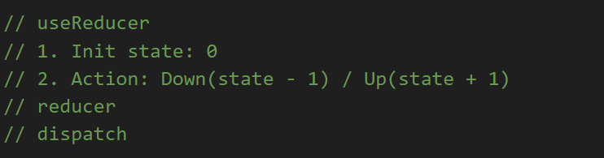

## UseContext

**1. Tại sao phải dùng useContext:**

**2. Use Context là gì?**

- [x] useContext là một react hook function
- [x] Giúp biến state thành state global - thuận tiện cho shared state
- [x] Thuận tiện cho việc maintain code
- [x] Giải quyết vấn đề ở truyền dữ liệu từ cấp cha xuống cấp con, rùi xuống cấp cháu và ngược lại
- [x] useContext chúng ta có thể chia sẻ state tới các component

**3. Cách sử dụng useContext**

- Gồm 3 bước:

1. Create Context:
   
2. Provider
   
3. Consumer
   

## UseReducer

**1. Tại sao phải dùng useReducer**

- Trong trường hợp logic state của component trở nên lớn và phức tạp hợp thì khi đó dùng ta sẽ dùng một hàm hook là useReducer sẽ giúp chúng ta dễ quản lý và tổ chức state tốt hơn.

**2. useReducer là gì**

- [x] useReducer là một react hook function
- [x] useReducer là một phiên bản nâng cao của useState
- [x] useReducer thì cho phép chúng ta cập nhật giá trị mới cho state
- [x] Dùng trong trường hợp local state của component phức tạp, có nhiều action làm thay đổi state đó. Thay vì các bạn dùng nhiều useState hoặc useState với value là nested object/array và viết nhiều function để thay đổi state thì bây giờ các bạn có thể tổ chức state và các action làm thay đổi state đó 1 cách logic nhờ useReducer
- [x] Reducer như là một bộ chuyển đổi, nhận input, thực hiện action tác động đến input đó, rồi tạo ra output.

**3. Cách dùng useReducer**

- Đây là hàm tăng giảm count bình thường
  

- Các bước được xác định với hàm count sử dụng useState
  

- Các bước được xác định với hàm count sử dụng useReduce
  

- Thực hiện từng bước để sử dụng useReducer
  
  

- Vd todoapp

```sh
import React, { useReducer } from 'react'
import './App.scss'

// useReducer
// 1. init State
const initState = {
  todoInput: '',
  todos: []
}
// 2. actions
const SET_INPUT_VALUE = 'set_input_value'
const ADD_TODO = 'add';
const UPDATE_TODO = 'update';
const DELETE_TODO = 'delete';

const setTodo = payload => ({
  type: SET_INPUT_VALUE,
  payload
})

const updateTodo = (index) => ({
  type: UPDATE_TODO,
  index,
})

const deleteTodo = (index) => ({
  type: DELETE_TODO,
  index
})
// 3. reducer
const reducer = (state, action) => {
  switch(action.type)
  {
    case SET_INPUT_VALUE:
      return {
        ...state,
        todoInput: action.payload
      }
    case ADD_TODO:
      return {
        todos: [...state.todos, state.todoInput],
        todoInput: ''
      }
    case UPDATE_TODO: {
      state.todoInput = state.todos[action.index];
      return {
        ...state,
      }
    }
    case DELETE_TODO: {
      let deleteTodo = [...state.todos];
      deleteTodo.splice(action.id,1);
      console.log(deleteTodo);
      return {
        ...state,
        todos: [...deleteTodo]
      }
    }
    default:
      throw new Error("Invalid action")
  }
}
// 4. dispatch

function App() {
  const [todo, dispatch] = useReducer(reducer, initState);
  return (
    <div className='app'>
      <h1>Todo</h1>
      <input
        type="text"
        placeholder='Enter your todo'
        value={todo.todoInput}
        onChange={e => dispatch(setTodo(e.target.value))}
      />
      <button onClick={() => dispatch({type: ADD_TODO})}>Add todo</button>

      <ul>
        <li>Quét nhà &times;</li>
        <li>Rửa bát &times;</li>
        <li>Nấu cơm &times;</li>
        {
          todo?.todos && todo.todos.map((item, index) => (
            <li key={index}>
              <p style={{display:'inline'}}>
                {item}
              </p>
              <button onClick={() => dispatch(deleteTodo(index))}>&times;</button>
              <button onClick={() => dispatch(updateTodo(index))}>Sửa</button>
            </li>
          ))
        }
      </ul>
    </div>
  )
}

export default App
```
