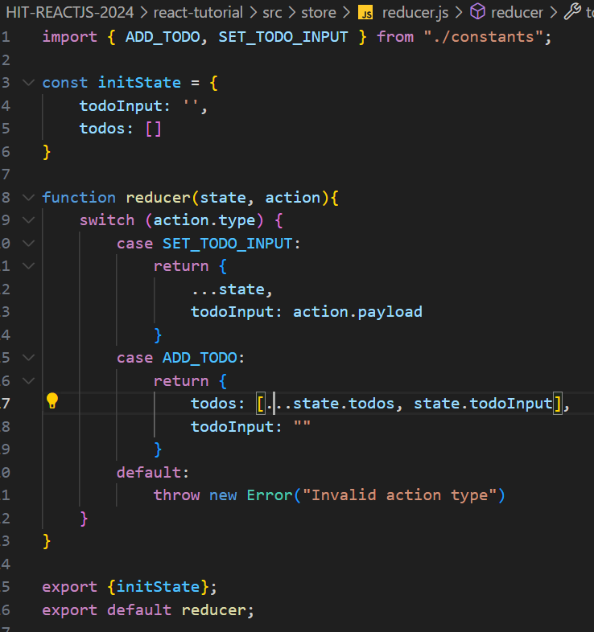

### Global State with Context + useReducer

- Cây thư mục:
  
- File Context.jsx
  
- File Provider
  
- File reducer.js
  
- File actions.js
  
- File constants.js
  
- File hooks:
  
- File index.js
  

### REDUX CORE

### 1. Why

**Vấn đề**
Tưởng tượng bạn đang viết một ứng dụng quản lý phim có tính năng đăng nhập và xem danh sách các phim. Các component được tổ chức như sau:

- [x] MoviesList: Hiển thị danh sách các phim, bao gồm 1 list các component Movie
- [x] Movie: là 1 item trong MoviesList, hiển thị thông tin một phim
- [x] Login: chức năng đăng nhập
      
      Ta có data là danh sách thông tin các phim, khi đó data được chuyển đổi qua lại giữa các component trong ứng dụng như thế nào? Theo kiến thức cơ bản đã được học, ta có thể để data là state trong MoviesList, rồi truyền data xuống component Movie dưới dạng props:
      
      Cách này ổn cho đến khi ta thêm 1 component mới, ví dụ như Search, để search các phim, và nó cũng sử dụng data. Vì là 1 component riêng, ta không thể truyền data từ component MovieList sang bằng props được:
      
      Lúc này ta buộc phải đưa data lên component ở trên nữa là App mới có thể truyền data xuống Search component. Dễ thấy theo mô hình này, khi ứng dụng mở rộng thêm các loại data khác, tất cả sẽ được đưa vào App và các hàm xử lý data cũng phải định nghĩa ở App, khiến App component trở nên khổng lồ với vô vàn trách nhiệm. Bad design!
      

**Giải pháp**
Với Redux, ta đưa tất cả data, các state vào 1 nơi gọi là store, khi component nào cần dùng hoặc thay đổi data, nó sẽ lấy hoặc cập nhật data ở store. Các data trong các component là thống nhất với nhau vì store là toàn cục trong toàn bộ App.


### 2. What

- Redux là một pattern(khuôn mẫu)
- Là một thư viện JS dùng để quản lý và cập nhập state của ứng dụng

### 3.When

- Redux sẽ rất hữu dụng đối với các trường hợp sau đây:

* Redux là 1 thư viện Javascript để quản lý state của ứng dụng, thường được sử dụng với javascript framework như React.
* Dự án có số lượng lớn state và các state được sử dụng ở nhiều nơi
* State được cập nhập thường xuyên
* Logic code cập nhập state phức tạp
* Ứng dụng có số lượng code trung bình hoặc lớn và có nhiều người làm chung
* Cần debug và muốn xem cách state được cập nhật tại bất kỳ khoảng thời gian nào

### 4. HOW

- [x] Cơ chế hoạt động của nó được tóm gọn trong 1 sơ đồ đơn giản:
      

- [x] Các thành phần của Redux bao gồm:

* Store: Store đơn giản là 1 object chứa tất cả state toàn cục của ứng dụng. Nhưng thay vì lưu các state, nó lưu các reducer.
* Các Action: Khi ta định nghĩa các action, ta khai báo các tên của hành động trong ứng dụng. Lấy ví dụ ta có 1 state là counter và cần 2 phương thức để tăng và giảm giá trị của counter. Lúc này ta định nghĩa 2 action có tên là 'INCREMENT' và 'DECREMENT' và chỉ vậy thôi, việc xử lý thay đổi state của counter sẽ nhường cho reducer.
* Các Reducer: 1 reducer tương đương với 1 state nhưng kèm theo các mô tả state sẽ thay đổi như thế nào khi các action khác nhau được gọi. Trong ví dụ ta có reducer là counter, nó lưu state của counter và kiểm tra action vừa được gọi là INCREMENT hay DECREMENT và trả về state mới là state+1 hay state-1 tương ứng.
* Các Dispatch: Khi cần dùng 1 action ở component, ta gọi action đó đơn giản bằng cách sử dụng phương thức dispatch. VD: dispatch(increment()), dispatch(decrement()).

- [x] Các bước dùng redux

**B1: Cài đặt**

```sh
    npm install redux react-redux
```

**B2: Tạo configureStore**


**B3: Tạo file chức năng**

**Còn các bước khác chị viết chưa kịp**
