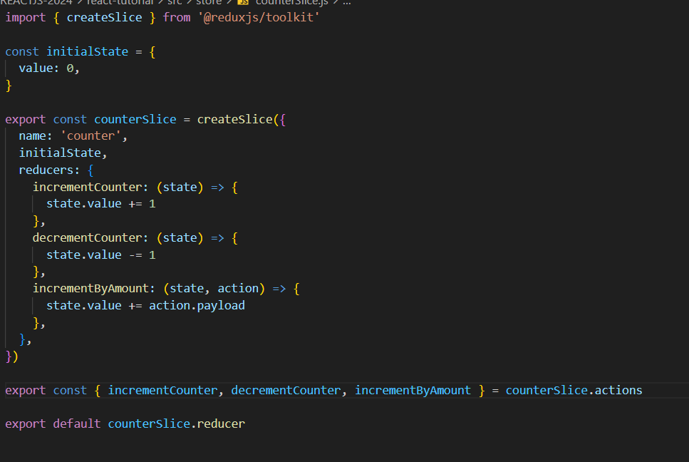
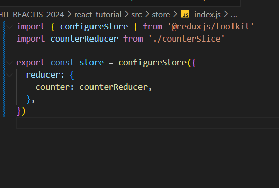
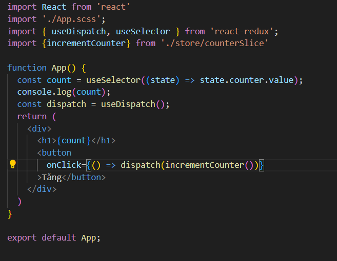

## REDUX TOOLKIT

#### Why

- Cấu hình một cửa hàng Redux quá phức tạp.
- Tôi phải thêm rất nhiều gói để Redux có thể làm được bất cứ điều gì hữu ích.
- Redux yêu cầu quá nhiều mã soạn sẵn.

==> RTK là một thư viện giúp mình viết Redux tốt hơn, dễ hơn và đơn giản hơn. (tiêu chuẩn để viết Redux)

#### RTK bao gồm những gì?

- [x] configureStore()
- [x] createReducer()
- [x] createAction()
- [x] createSlice()
- [x] createSelector()
- [x] createAsyncThunk()
- [x] createEntityAdapter()

#### HOW

##### B1: Cài đặt redux-toolkit

```sh
    npm install @reduxjs/toolkit react-redux

    or

    yarn add @reduxjs/toolkit react-redux
```

##### B2: Tạo slice



##### B3: Fix file index.js



##### B4: App.js


