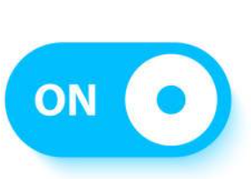

## Bài tập về nhà buổi 2

#### 1. Ôn tập:
- [x] useState
- [x] props, props children
- [x] rendering list

#### 2. Yêu cầu tìm hiểu thêm về:
- [x] sass/scss
- [x] Tailwind css
- [x] Style-components
- [x] Css module

#### 3. Bài tập về nhà
- [x] Bài 1: Dùng dữ liệu trong file posts.json thuộc folder data chị có cho trong code mẫu đấy và render dữ liệu ra màn hình dưới dạng table có 3 cột (id, title, body) - lưu ý dùng rendering list, props, props. Yêu cầu bảng được style theo mẫu sau:
    
- [x] Bài 2: sử dụng useState để tạo nút toggle (lưu ý: nút toggle phải di chuyển trái phải mỗi khi click vào ô tròn đồng thời chữ on cũng sẽ thay đổi thành off trong các trường hợp tương ứng)
    
- [x] Bài 3(bonus - không bắt buộc phải làm): sử dụng useState để tạo một con chatbot ảo. Có thể clone theo mẫu sau:
    
- [x] Dealine: 20h ngày 17/3
- [x] Yêu cầu nộp link deploy(có thể là vercel hoặc github page) và link code trên github
- [x] Lưu ý các bạn có thể chia nhánh branch trên GitHub để tránh việc khởi tạo lại dự án. Với mỗi BTVN là một nhánh riêng biệt. 
