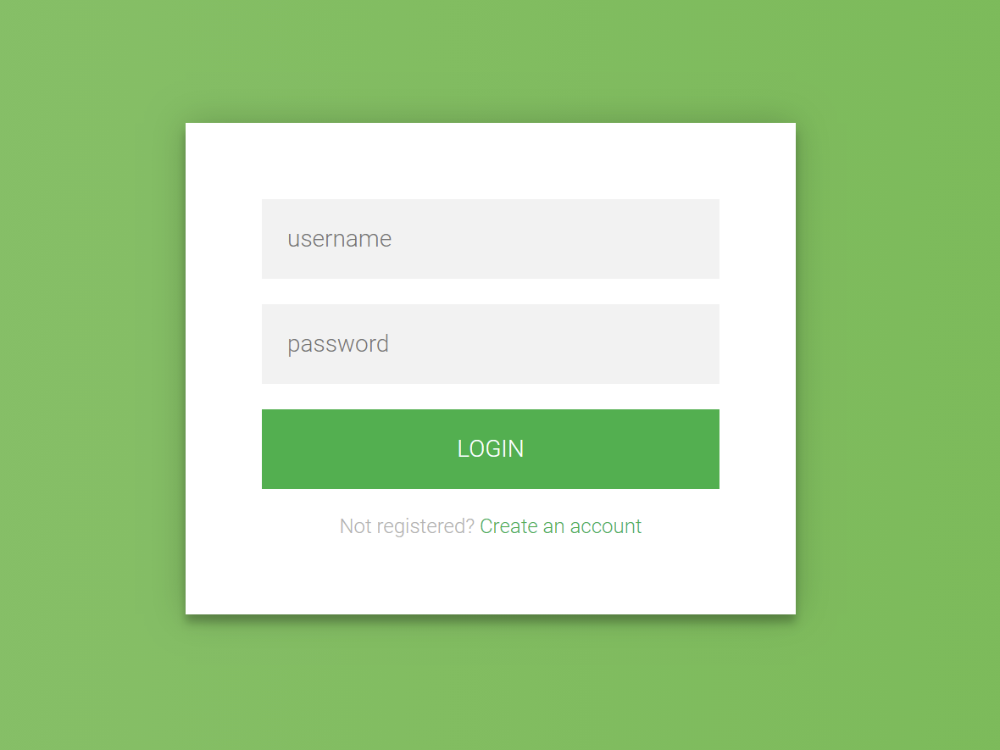
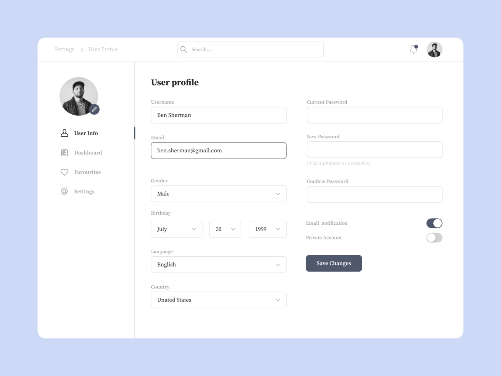

## Bài tập về nhà buổi 5

#### 1. Ôn tập:

- [x] useCallback
- [x] formik
- [x] Yup

#### 2. Yêu cầu tìm hiểu thêm về:

- [x] router

#### 3. Bài tập về nhà

- Dùng formik để hoàn thành 3 bài tập sau:
- [x] Bài 1: Validate form sau:
      

  - Theo yêu cầu:
    - Trường username: người dùng không được bỏ trống, người dùng phải nhập tối thiểu 5 ký tự, người dùng phải nhập theo đúng format viết hoa chữ cái đầu của mỗi từ sau khoảng trắng (vd: Nguyen Thi Trang)
    - Trường password: password không được bỏ trống, password phải nhập tối thiểu 8 ký tự, password phải bao gồm một ký tự in hoa, hai ký tự thường, một ký tự chữ số, một ký tự đặc biệt
    - Khi click vào button login thì in ra dữ liệu vừa nhập vào màn hình console

- [x] Bài 2: Clone trang web sau:
      

  - Yêu cầu validate tất cả các trường không được bỏ trống (bốn trường gender, birthday, language, country có thể mặc định dữ liệu)
  - Trường current password và new passowrd phải bao gồm một chữ cái và một số, và tối thiểu 8, tối đa 32
  - Trường confirm passowrd phải giống trường new password
  - Khi click vào button save changes thì in ra dữ liệu vừa nhập vào màn hình console

- [x] Bài 3: Responsive hai page của hai bài tập trên
- [x] Dealine: 20h ngày 21/4
- [x] Yêu cầu nộp link deploy(có thể là vercel hoặc github page) và link code trên github
- [x] Lưu ý các bạn có thể chia nhánh branch trên GitHub để tránh việc khởi tạo lại dự án. Với mỗi BTVN là một nhánh riêng biệt.
