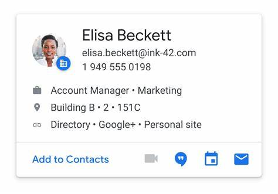

## Bài tập về nhà buổi 11

#### 1. Ôn tập:

- [x] useContext
- [x] useReducer
- [x] global state

#### 2. Yêu cầu tìm hiểu thêm về:

- [x] redux

#### 3. Bài tập về nhà

- [x] Bài 1: Dựa trên các file đã chia hãy hoàn thành nốt ứng dụng todoapp (nhớ css nha)
- [x] Bài 2: Làm thêm một header, bên trái có logo(kiếm logo bất kỳ), bên phải là một menu. Yêu cầu:
  - Khi click vô logo, sẽ về trang home
  - Trang home sẽ là một cái card nhỏ, giới thiệu về bản thân các bé(có thể tham khảo mẫu trên mạng)
    VD:
    
  - Menu gồm các trang:
    - start-boostrap đã code ở bài ở btvn 8
    - login ở bài 7
    - todoapp (bài 1 bên trên)
    - icon hoặc nút toggle đều được, khi click vô thì giao diện chuyển chế độ dark mode (chỉ cần darkmode bên todoapp bài 1, khuyến kích làm tất cả các giao diện khác)
      Mô phỏng header
      
- [x] Dealine: 23h59 ngày 19/5
- [x] Yêu cầu nộp link deploy(có thể là vercel hoặc github page) và link code trên github
- [x] Lưu ý các bạn có thể chia nhánh branch trên GitHub để tránh việc khởi tạo lại dự án. Với mỗi BTVN là một nhánh riêng biệt.
